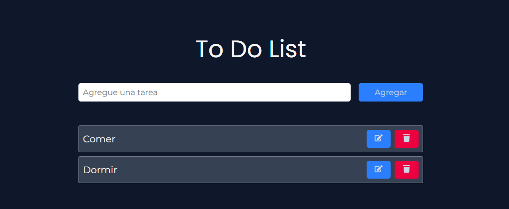

# To Do List 📋

<p align="center">
  
</p>

## 👋¡ Bienvenido a la aplicación To Do List! 
Con esta aplicación usted prodra gestionar de manera eficiente sus **tareas pendientes.**


## Tecnologías que implementé en este proyecto:
  - **React**: Desarrollo de la UI
  - **CssModules**: Estilados de componentes
  - **Hooks y CustomHooks**: Para manejar los estados y la lógica de la aplicación
  - **LocalStorage**: Para Guardar tus tareas.

### Funcionalidades 🚀
  - **Agregar** Tareas :white_check_mark:
  - **Modificar** Tareas :white_check_mark:
  - **Eliminar** Tareas :white_check_mark:
  - **Guardar** Tareas en Local Storage :white_check_mark:

### ¿Cómo empezar?
1. **Clone el repositorio**
```bash
git clone https://github.com/PabloVicente19/ToDoList.git
```
2. **Instale dependencias**
```bash
npm install
```
3 **inicie la aplicacion**
```bash
npm start
```